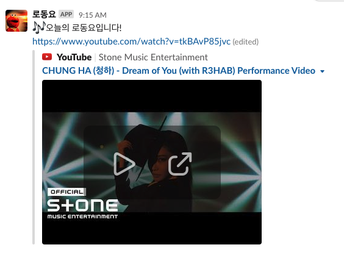

## 매일 알림주는 슬랙봇 (진짜) 간단하게 만들고 싶을 때

가끔 매일 뭔가 알림을 주는 슬랙봇을 만들고 싶을 때가 있습니다. 재미 삼아 만든 노동요 봇(유튜브 MostPopular 50곡 중에서 추천)과 함께 그 방법을 공유해보자면,

1. 먼저 [Google Drive](http://drive.google.com/)에 갑니다.
2. 오른쪽 버튼을 눌러 Apps script를 클릭해줍니다.
3. Apps script 타이틀을 눌러 원하는 이름(~~저는 RoDongYo라고 했습니다~~)을 지정합니다.
4. 저는 음악 추천에 YouTube Data API를 사용할 예정인데, 마침 다행히도 [Apps Script는 YouTube Data API를 지원](https://developers.google.com/apps-script/advanced/youtube)하여 사용하기로 합니다(인증도 한큐에 해결!)
5. 다만 YouTube Data API는 Advanced 기능이므로 사용 설정이 필요합니다. 리소스 > 고급 Google 서비스 가장 마지막 **YouTube Data API v3**를 Toggle On 해줍니다.
6. 켜졌다면 `YouTube.Videos.list`와 같은 방식으로 특정 비디오들을 검색할 수 있습니다. 
7. 제가 작성한 노동요를 검색하는 코드는 아래와 같습니다. 미리 파라미터를 준비했는데 *"검색조건을 mostPopular이고, 한국언어 설정에 한국 YouTube의 음악카테고리(코드 번호: 10)에서 비디오 최대 50개까지 검색해줘"*라는 요청을 만들었습니다
```js
function findRoDongYo() {
  const playList = YouTube.Videos.list("id", {
    chart: "mostPopular",
    hl: "ko_KR",
    regionCode: "KR",
    videoCategoryId: "10",
    maxResults: 50
  });
  const videos = playList.items;
  // Logger.log(videos);
  const selected = Math.floor(Math.random() * videos.length);
  return videos[selected];
}
```
8. 위 코드를 보다가 `selected`는 뭐지 하실까봐, 50개 중에 1개만 slack으로 보내기 위해 random하게 선택하는 로직을 붙였습니다(안붙이면 매일 BTS노래로 아침을 시작할 것만 같았습니다)
9. 자, 이제 중간 단계까지 왔으니 제가 일부로 마련한 `Logger.log` 주석을 풀어 API가 정상적으로 불러지는지 봅시다. 위에 곤충(Debug 버튼)버튼 옆에 플레이 버튼(▶️)을 클릭해줍니다.
10. 정상적으로 동작했다면 `보기 > 로그`에서 로그가 제대로 찍히는 것을 볼 수 있을 겁니다.
11. 이제 슬랙에 보낼 차례입니다. 슬랙 앱을 하나 만들고 각자의 워크스페이스에 설치한 후 **xoxp로 시작하는 토큰**을 가져옵니다.
12. 이제 GAS에 슬랙으로 선택된 노동요를 보내는 코드만 작성하면 됩니다. 코드는 아래와 같습니다. `findRoDongYo`함수 위나 아래 어디든 붙여주세요.
```js
function postRoDongYo() {
  const roDongYo = findRoDongYo();
  const payload = {
    channel: "<채널ID>",
    text: "🎶오늘의 로동요입니다! \n https://www.youtube.com/watch?v=" + roDongYo.id
  };
  const headers = {
    Authorization: "Bearer <XOXP 토큰>"
  }
  const option = {
    method: "post",
    contentType: "application/json; charset=utf-8",
    headers: headers,
    payload: JSON.stringify(payload)
  };
  let response = UrlFetchApp.fetch("https://slack.com/api/chat.postMessage", option);
}
```

13. 랜덤으로 선택된 유튜브 음악 ID를 `youtube.com/watch?v=`에 붙여서 보내줍니다(~~ES6 템플릿이 안되는 관계로 concat을 해서 보내고 말았습니다~~)
14. 이제 슬랙봇을 노동요를 보내줄 채널을 골라, 채널 ID를 가져오고 payload에 값을 붙여줍니다.
15. 마무리로 이제 스케쥴만 잡아주면 됩니다. 시계 모양 버튼(🕑, 플레이 버튼 왼쪽)을 눌러 트리거를 만들어줍시다(~~코드로도 생성은 가능합니다만...~~)
16. 원하는 조건으로 트리거를 세팅했으면 정상적으로 원하는 채널에 슬랙봇이 음악을 추천해줄 겁니다.


